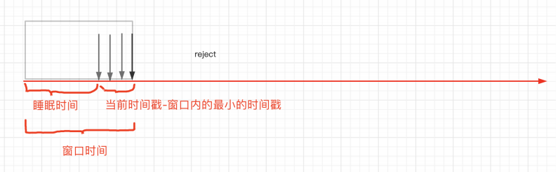

# rate-limit
基于 redis 实现滑动时间窗的限流组件
> 为了解决调用第三方接口过于频繁，或第三方为缓解压力主动限流而导致调用接口失败问题

## 思考过程
1. 由于第三方接口的特性，是根据接口中的用户和接口地址限流，与调用方的ip地址无关，因此支持分布式限流
2. 常见的限流算法有以下四种：
   1. 计数器：针对指定时间窗的访问计数，超过阈值拒绝访问。缺点：存在漏洞，上个窗口中途至下个窗口的中途会出现访问超限，但不拒绝情况
   2. 漏斗：大口进小口出，缺点：无法应对突击流量
   3. 令牌桶：以一个固定的速率向令牌桶发放令牌，桶满为至，缺点：实现复杂
   4. 滑动时间窗：计数器的升级版，统计更为精准，精准度取决于时间窗口的粒度。因此选择此种算法

## 需求
1. 以组件的形式实现，组件调用方可动态切换是否开启限流功能
2. 可定义限流时间窗大小，以及限流个数
3. 使用滑动时间窗，使统计更加精准

## 实现
1. 创建`RateLimitAutoConfiguration`，注入`RateLimitUtil`工具类
2. 创建`RateLimitConfig`，提供“窗口时间”和“限流次数”参数
   1. 限流次数`time`属性默认值 -1，表示不限流，若大于 0，则表示限流
3. 创建`Accept`，使用jdk8的函数式接口传递第三方接口调用方法
4. 使用redis支持的lua脚本，以zset结构存储，原子性操作redis
   1. 计算上个窗口的结束时间：当前时间戳 - 窗口时间（单位毫秒）
   2. 清除过期的数据，即上个窗口之前的
   3. 不超过限流次数则`zadd`，然后执行`Accept`
   4. 超过限流次数则返回当前窗口最小的数据时间戳，计算睡眠时间：窗口时间 - （当前时间戳 - 最小时间戳），线程睡醒后再从头判断


## 使用
1. 在需要使用的服务中引入依赖`implementation('xu.modules:modules-rate-limit:0.0.1-SNAPSHOT') { changing = true }`
2. 在 SpringBoot 的启动类使用`@ComponentScan`注解，扫描组件路径
3. 注入`RateLimitUtil`，即可使用
```java
@Autowired
private RateLimitUtil rateLimitUtil;

rateLimitUtil.execute(() -> {
   System.out.println("hello world");
   return null;
}, new RateLimitConfig(10000L, 4), "hello:key");
```

## 遇到的问题
- 起初考虑用Java获取时间戳作为参数传递，因此需要使用分布式锁，则使用`Redisson`。因为`Redisson`自动使用了“看门狗”功能，并且加锁方便。但发现使用了`Redisson`分布式锁后，无法在lua脚本中使用Redis命令，因此舍弃
- 然后使用redis的`time`命令，能够直接使用lua脚本的原子性，但没注意到其返回值是“秒”+“微秒”，后来对其转换为“毫秒”
- lua中使用redis命令`ZRANGEBYSCORE`的返回值是set类型，无法直接转换为number类型，需要进行遍历
- `RedisTemplate`执行lua时的传参，传入lua后都会变成string类型
- 
>>>>>>> Stashed changes
